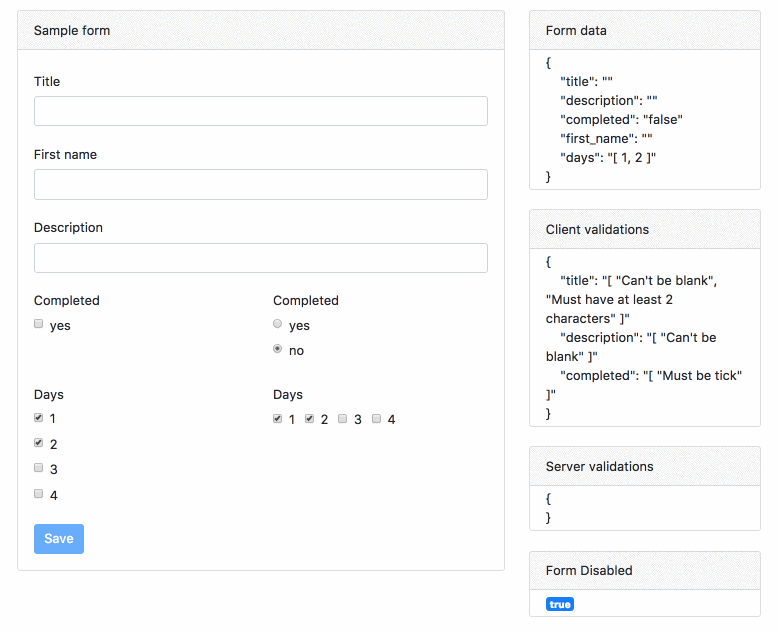
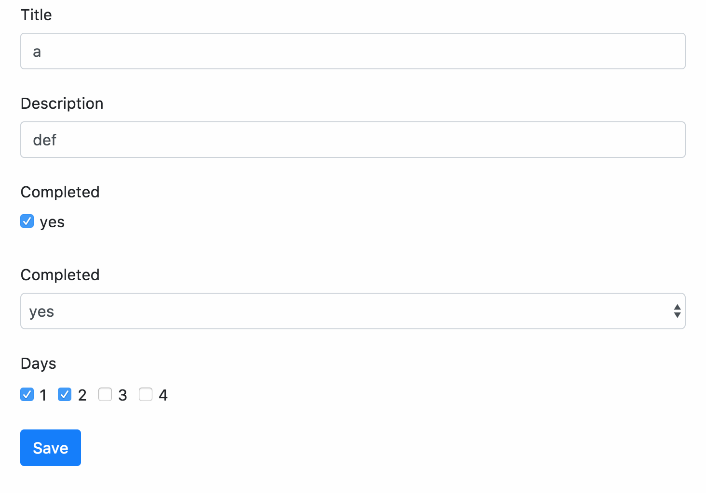

**Vuex Simple Form**\
VueJS form with vuex, inspired by Rails gem simple_form, which simplify the process of making form in Vue with following
goals:

> * Auto generate code for form quickly using bootstrap 4 style(support for all input type with label & error-indicator
>   for each field)
> * Handle client-side validations (on typing)
> * Handle server-side validations (after submit form)
> * Simple to use

**DEMO**

# 

```html
<form @submit.prevent='onSubmit'>
    <field for='title' />
    <field for='description' />
    <field for='completed' type='checkbox' :collection='options.completed' />
    <field for='completed' type='radio' :collection='options.completed_radio' />
    <field for='days' type='checkbox' :collection='options.days' :inline='true' />
    <button class='btn btn-primary' type='submit'>
      Save
    </button>
  </form>
```

Just wanna play with it? [Check out my sandboxes](https://codesandbox.io/s/0mxvw6zwrv)

## Installation

Install the core package:

```bash
npm install vue-simple-form --save
```

## Vuex setup

import VuexForm from the package

```javascript
import VuexForm from 'vuex-simple-form'

Vue.use(Vuex)

const store = new Vuex.Store({
  modules: {
  	form: VuexForm,
    ... // your other modules
  }
})
```

then add store to our Vue App

```javascript
new Vue({
  el: '#app',
  store: store,
  template: '<App/>',
  components: { App }
})
```

Vuex form module provide you with the following getters & actions

**Getters**

* `form (Object)` our current form object
* `disabled (Boolean)` return true if form pass all validation checking (both client & server side)

**Actions**

* `set_form({form_object})` set the form

### Create new form

```javsacript
import { mapActions } from 'vuex'

export default {
  data: () => ({
    todo: {
      title: 'a',
      description: 'def',
      completed: true,
      days: [1,2]
    }
  }),

  methods: {
    ...mapActions(['set_form'])
  },

  created: function() {
    this.set_form({
      ...this.todo
    })
  }
}
```

the set_form object can take additional 2 parameters

| Params     | Description                                          | Default |
| ---------- | ---------------------------------------------------- | ------- |
| horizontal | set form horizontal (label & input in the same line) | false   |
| validator  | set client-side validation rules (detail below)      | null    |

### Import the Field Component

Currently vuex-simple-form only support Bootstrap 4 input components, more are coming. Don't forget to add Bootstrap 4
CSS to your application, the easiest way is to add CDN to your `index.html` file

```html
<link rel="stylesheet" href="https://maxcdn.bootstrapcdn.com/bootstrap/4.0.0-beta.2/css/bootstrap.min.css" integrity="sha384-PsH8R72JQ3SOdhVi3uxftmaW6Vc51MKb0q5P2rRUpPvrszuE4W1povHYgTpBfshb"
      crossorigin="anonymous">
```

You only need to import only one Component for all type of input

```javascript
import { BS4Field as Field } from 'vuex-simple-form'
export default {
	components: { Field },
    ... // your component data, methods, computed, etc
}
```

Following are all field props you can use

| Property    | Description                                                                                      | Type                                          | Required | Default        |
| ----------- | ------------------------------------------------------------------------------------------------ | --------------------------------------------- | -------- | -------------- |
| for         | the variable that the input present                                                              | String                                        | `Yes`    |                |
| type        | `text` `password` `number` `date` `checkbox` `radio` `textarea` `select`                         | String                                        | `No`     | `text`         |
| label       | label for the input, if you pass a string, it will be the label, pass `false` for turn off label | String/Boolean                                | `No`     | the field name |
| placeholder | placeholder                                                                                      | String                                        | `No`     | `null`         |
| collection  | options for input with type `checkbox/radio/select`                                              | `[{text: xxx, value: xxx}, ...]` or `[a,b,c]` | `No`     | `[]`           |
| inline      | additional option for input type `checkbox/radio/select` to set all the options stay in one line | Boolean                                       | `No`     | `false`        |

When using with pug/jade templating language for writing html, you could make form with very few lines of code like this

```html
<template lang='pug'>
form(@submit.prevent='onSubmit')
  field(name='title')
  field(name='first_name')
  field(name='description')
  field(name='completed', type='checkbox', :collection='options.completed')
  field(name='completed', type='radio', :collection='options.completed_radio')
  field(name='days', type='checkbox', :collection='options.days', :inline='true')
  button.btn.btn-primary(type='submit', :disabled='disabled') Save
</template>
```

and a form like this will be generate for you

# 

## Client-side validation

Client side validation can be easily done by create a validator function and pass to the set_form action (inspired by
redux-form validation) Below is a function that take form data and return errors in form of object.

```javascript
// creat validator function
const TodoValidator = values => {
  const errors = {}
  const addErrors = (field, text) => { errors[field] = (errors[field] || []).concat(text) }

  if (!values.title) addErrors('title', "Can't be blank")
  if (values.title.length < 2) addErrors('title', 'Must have at least 2 characters')
  if (!values.description) addErrors('description', "Can't be blank")
  if (!values.completed) addErrors('completed', "Must be tick")
  return errors
}

// pass the validation functions to the set_form action
created: function() {
    this.set_form({
      ...this.todo,
      horizontal: true,
      validator: TodoValidator
    })
  },
```

## Submitting the form & Handle server side validation

the form data to be submit can be call by this.form.data() then you can use any network library to call api to submit
the form

```javascript
import { mapGetters } from 'vuex'
....
export default {
  computed: mapGetters(['form']),
  methods: {
    ... // other methods, etc

    onSubmit() {
      const data = this.form.data()
      axios.post(url, data)
        .then(response => {
          console.log(response)
        })
        .catch(error => {

          // transform the error to an object, here is just an example
          const server_errors = {
            title: ["Can't be blank", 'too short'],
            description: "Can't be blank"
          }

          // use the following call to add server errors to vuex form
          this.form.errors.record(server_errors)
        })
      )
    }
  }
}
```

## Motivation

Vuex-simple-form is inspired by\
[Simple Form](https://github.com/plataformatec/simple_form), a gem that greatly facilitates creating forms in Rails.\
[Redux Form](https://github.com/erikras/redux-form) The Server Validation is inspired by this.\
[Laracasts Vue 2 series](https://laracasts.com/series/learn-vue-2-step-by-step/episodes/19) The form object approach and
client side validation.

The idea of vuex-simple-form is not something new, it just I could not find the tool to satisfy all my need, so I decide
to write a new one, also it help me to learn alot, it's my first time try to write one. I have implement it on my
project using Bootstrap 4, hopefully it could help you too.
